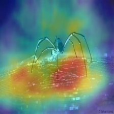

# GCAV: A Global Concept Activation Vector Framework for Cross-Layer Consistency in Interpretability


## 📝 Paper

**[GCAV: A Global Concept Activation Vector Framework for Cross-Layer Consistency in Interpretability](https://arxiv.org/abs/xxxx.xxxxx)**  
*Zhenghao He, Sanchit Sinha, Guangzhi Xiong, Aidong Zhang*  
University of Virginia  
**ICCV 2025** (Accepted)

## 🧩 Overview

**Global Concept Activation Vector (GCAV)** is a novel framework designed to improve the interpretability of deep neural networks by addressing the fundamental limitations of traditional **Testing with Concept Activation Vectors (TCAV)**. 

### Key Problems Solved

Traditional TCAV faces several critical issues:
- **🔄 Unstable layer selection**: The same concept may have varying importance across layers
- **❌ Spurious activations**: Certain layers assign high TCAV scores to irrelevant concepts
- **📊 High variance in TCAV scores**: Inconsistencies in concept representation across layers

### Our Solution

GCAV unifies CAVs into a single, semantically consistent representation through:

- **🎯 Contrastive learning** to align concept representations across layers  
- **🧠 Attention-based fusion** to construct a globally integrated CAV
- **🔄 Decoder-based projection** to enable TCAV evaluation on GCAV representations (**TGCAV**)

### Key Advantages

- ✅ **Cross-Layer Concept Consistency**: Eliminates inconsistencies in TCAV scores across layers
- 🎯 **Improved Concept Localization**: Enhances interpretability by refining concept attributions  
- 🛡️ **Adversarial Robustness**: Provides more stable explanations under adversarial perturbations
- 🔧 **Architecture Agnostic**: Works with multiple deep architectures (ResNet, GoogleNet, MobileNet)

## 🏗️ Framework Architecture

Our framework consists of three sequential training stages:

1. **Layer-wise Autoencoder Training**: Compress high-dimensional CAVs into unified embedding space
2. **Cross-Layer Alignment**: Use contrastive learning with InfoNCE and consistency loss
3. **Global CAV Fusion**: Attention-based fusion with variance and consistency optimization


## 🛠 Installation

### Prerequisites

- Python 3.9+
- CUDA-compatible GPU (recommended)
- 30+ GB free disk space for datasets

### Setup Environment

```bash
# Clone the repository
git clone https://github.com/your-username/CAVFusion.git
cd CAVFusion

# Create conda environment
conda create --name gcav python=3.9
conda activate gcav

# Install dependencies
pip install -r requirements.txt
```

### Key Dependencies

```
torch>=2.1.0
tensorflow>=2.18.0
tcav>=0.2.2
scikit-learn>=1.6.0
matplotlib>=3.9.0
numpy>=1.26.4
h5py>=3.12.1
```

## 🚀 Quick Start

### 1. Dataset Preparation

Download the required datasets and pre-trained models:

```bash
# Download Broden dataset for concept images
python src/download_data.py

# Download pre-trained models (GoogleNet, ResNet50V2, MobileNetV2)
python src/load_models.py
```

### 2. Configuration

Edit `src/configs.py` to specify your experimental setup:

```python
# Target class and concepts
target = 'zebra'
concepts = ["dotted", "striped", "zigzagged"]

# Model selection
model_to_run = 'GoogleNet'  # or 'ResNet50V2', 'MobileNetV2'

# Training parameters
embed_dim = 2048
hidden_dims = [4096]
nce_loss = 1
con_loss = 3
var_loss = 3
sim_loss = 1
```

### 3. Generate Original CAVs

```bash
python src/get_cavs_main.py
```

### 4. Train GCAV Framework

```bash
# Stage 1: Train autoencoders for dimension alignment
python src/align_dim.py

# Stage 2 & 3: Train alignment and fusion models
python src/integrate_main.py
```

### 5. Evaluate Results

```bash
# Generate TGCAV scores and visualizations
python src/evaluate.py

# Plot comparative results
python src/plot_result.py
```

## 📊 Experimental Results


### Performance Improvements

Our experiments on **GoogleNet**, **ResNet50V2**, and **MobileNetV2** demonstrate significant improvements. The following table shows detailed results for different target classes and concepts:

| Target | Concept | Method | GoogleNet |   |   |   | ResNet50V2 |   |   |   | MobileNetV2 |   |   |   |
|:------:|:-------:|:------:|:---------:|:--:|:--:|:--:|:----------:|:--:|:--:|:--:|:-----------:|:--:|:--:|:--:|
|        |         |        | **Mean** | **Std** | **CV** | **RR** | **Mean** | **Std** | **CV** | **RR** | **Mean** | **Std** | **CV** | **RR** |
| **Spider Web** | cobwebbed | TCAV | 0.808 | 0.140 | 0.173 | 0.508 | 0.644 | 0.127 | 0.197 | 0.715 | 0.619 | 0.169 | 0.273 | 0.985 |
|        |         | **TGCAV** | **0.840** | **0.109** | **0.130** | **0.381** | **0.784** | **0.083** | **0.105** | **0.357** | **0.554** | **0.091** | **0.164** | **0.686** |
|        | porous | TCAV | 0.499 | 0.123 | 0.246 | 0.862 | 0.586 | 0.098 | 0.167 | 0.717 | 0.377 | 0.059 | 0.157 | 0.584 |
|        |         | **TGCAV** | **0.498** | **0.037** | **0.074** | **0.281** | **0.640** | **0.030** | **0.047** | **0.156** | **0.296** | **0.032** | **0.108** | **0.338** |
|        | blotchy | TCAV | 0.459 | 0.210 | 0.457 | 1.460 | 0.574 | 0.107 | 0.186 | 0.871 | 0.438 | 0.133 | 0.304 | 1.005 |
|        |         | **TGCAV** | **0.393** | **0.057** | **0.144** | **0.508** | **0.618** | **0.026** | **0.042** | **0.129** | **0.386** | **0.043** | **0.111** | **0.466** |
| **Zebra** | dotted | TCAV | 0.463 | 0.218 | 0.470 | 1.576 | 0.470 | 0.063 | 0.135 | 0.426 | 0.484 | 0.130 | 0.268 | 0.950 |
|        |         | **TGCAV** | **0.373** | **0.019** | **0.051** | **0.161** | **0.479** | **0.046** | **0.096** | **0.376** | **0.408** | **0.021** | **0.051** | **0.196** |
|        | striped | TCAV | 0.783 | 0.185 | 0.236 | 0.664 | 0.593 | 0.073 | 0.123 | 0.421 | 0.601 | 0.145 | 0.241 | 0.832 |
|        |         | **TGCAV** | **0.699** | **0.042** | **0.060** | **0.200** | **0.597** | **0.050** | **0.084** | **0.318** | **0.600** | **0.017** | **0.029** | **0.083** |
|        | zigzagged | TCAV | 0.647 | 0.232 | 0.359 | 0.974 | 0.578 | 0.051 | 0.088 | 0.277 | 0.618 | 0.095 | 0.153 | 0.615 |
|        |         | **TGCAV** | **0.503** | **0.027** | **0.055** | **0.159** | **0.597** | **0.049** | **0.083** | **0.268** | **0.628** | **0.031** | **0.049** | **0.175** |

**Metrics Explanation:**
- **Mean**: Average TCAV/TGCAV scores across layers
- **Std**: Standard deviation (lower = more stable)  
- **CV**: Coefficient of variation (lower = more consistent)
- **RR**: Range ratio (lower = less fluctuation across layers)

### Key Findings

- **🎯 Reduced Variance**: TGCAV significantly reduces variance in concept activation scores across layers
- **🛡️ Adversarial Robustness**: 40-60% more stable under adversarial attacks compared to traditional TCAV
- **📈 Better Localization**: More precise concept attribution with reduced spurious activations

### Adversarial Robustness Evaluation

We evaluated the robustness of GCAV against adversarial attacks using Brown's method, targeting the "dotted" concept in the "zebra" class at the GoogleNet mixed5a layer:

| Method | Mixed5a | Mixed5a Change (%) | Mean | Mean Change (%) |
|:------:|:-------:|:-----------------:|:----:|:--------------:|
| **TCAV** | 0.52 | -- | 0.46 | -- |
| **TCAV (Attacked)** | 0.96 | **+84.61%** | 0.75 | **+61.77%** |
| **TGCAV** | 0.38 | -- | 0.37 | -- |
| **TGCAV (Attacked)** | 0.49 | **+28.49%** | 0.53 | **+42.63%** |

**Key Robustness Insights:**
- **Traditional TCAV**: Vulnerable to adversarial manipulation, with up to 84.61% increase in targeted layer scores
- **Our TGCAV**: More resilient with only 28.49% increase under the same attack
- **Global Integration**: By fusing information across layers, GCAV reduces the impact of single-layer perturbations

### Visual Results

#### Cross-Layer Consistency Improvement (Figure 2)
The following figure shows TCAV score comparisons across layers on GoogleNet before (left) and after (right) applying our method:


**Key Observations:**
- **Original TCAV (Left)**: High variance across layers, spurious activations in irrelevant concepts
- **Our TGCAV (Right)**: Consistent scores across layers, reduced spurious activations
- **Cross-layer stability**: TGCAV eliminates layer selection ambiguity

#### Concept Localization Maps (Figure 3)

Our GCAV framework provides improved concept localization through Visual-TCAV concept mapping. The visualization shows three representative concepts with **original method (top row)** vs **our method (bottom row)**:

| **Striped (Zebra)** | **Cobwebbed (Spider Web)** | **Honeycombed (Honeycomb)** |
|:---:|:---:|:---:|
|  |  |  |
|  |  |  |

**Concept Localization Benefits:**
- **🎯 Precise Focus**: Our method focuses more precisely on characteristic patterns while reducing distractions from irrelevant regions
- **🔍 Reduced Background Noise**: Less activation in background regions (sky, surrounding environment) compared to original TCAV
- **🌐 Semantic Consistency**: Better alignment with expected concept locations - stripes on zebra body, web structures, honeycomb patterns
- **📊 Enhanced Interpretability**: More concentrated activations on defining structural patterns, eliminating unnecessary activations in non-characteristic areas

## 📁 Project Structure

```
CAVFusion/
├── src/                      # Main source code
│   ├── configs.py           # Configuration settings
│   ├── get_cavs_main.py     # Generate original CAVs
│   ├── get_cavs.py          # CAV generation utilities
│   ├── align_dim.py         # Autoencoder training
│   ├── IntegrateCAV.py      # Core GCAV framework
│   ├── integrate_main.py    # Training pipeline
│   ├── evaluate.py          # Evaluation scripts
│   ├── plot_reslut.py       # Visualization tools
│   ├── attack.py            # Adversarial attack experiments
│   ├── concept_map.py       # Concept mapping utilities
│   ├── reconstruct.py       # CAV reconstruction
│   ├── load_models.py       # Model loading utilities
│   ├── download_data.py     # Data download script
│   ├── download_img.py      # Image download utilities
│   ├── select_img.py        # Image selection tools
│   ├── extract_500_birds.py # Bird dataset extraction
│   ├── createRandom.py      # Random dataset generation
│   └── concate.py           # Data concatenation utilities
├── imgs/                    # Images for README
│   ├── framework.png        # Framework architecture
│   ├── tcav_*.png          # Original TCAV results
│   └── tgcav_*.png         # Our TGCAV results
├── requirements.txt         # Dependencies
├── .gitignore              # Git ignore rules
├── LICENSE                 # MIT License
└── README.md               # This file
```

## 🎛️ Configuration Options

### Model Selection
```python
model_to_run = 'GoogleNet'    # GoogleNet (Inception)
model_to_run = 'ResNet50V2'   # ResNet50V2  
model_to_run = 'MobileNetV2'  # MobileNetV2
```

### Fusion Methods
```python
fuse_input = "aligned_cavs"    # Use aligned CAVs (recommended)
fuse_input = "input_cavs"      # Use original CAVs
fuse_input = "none_fuse"       # No fusion baseline
```

### Training Parameters
```python
# Alignment stage loss weights
nce_loss = 1      # InfoNCE loss weight
con_loss = 3      # Consistency loss weight

# Fusion stage loss weights  
var_loss = 3      # Variance loss weight
sim_loss = 1      # Similarity loss weight
```

## 🧪 Running Custom Experiments

### Add New Concepts

1. Prepare concept images in `data/concepts/your_concept/`
2. Update `src/configs.py`:
   ```python
   target = 'your_target_class'
   concepts = ["your_concept1", "your_concept2"]
   ```
3. Run the full pipeline as described in Quick Start

### Experiment with Different Architectures

Our framework supports any CNN architecture. To add a new model:

1. Implement model wrapper in `tcav/model.py`
2. Define bottleneck layers in `src/configs.py`
3. Update model loading logic

## 📈 Evaluation Metrics

### Stability Metrics
- **Coefficient of Variation (CV)**: Measures relative variability
- **Standard Deviation (Std)**: Absolute measure of dispersion
- **Range Ratio (RR)**: Normalized range of activation scores

### Robustness Evaluation
- **Adversarial Stability**: Performance under adversarial attacks
- **Cross-Layer Consistency**: Correlation between layer-wise activations
- **Concept Localization**: Precision of concept attribution

## 📄 Citation

If you find this work useful, please cite our paper:

```bibtex
@inproceedings{he2025gcav,
  title={GCAV: A Global Concept Activation Vector Framework for Cross-Layer Consistency in Interpretability},
  author={He, Zhenghao and Sinha, Sanchit and Xiong, Guangzhi and Zhang, Aidong},
  booktitle={Proceedings of the IEEE/CVF International Conference on Computer Vision (ICCV)},
  year={2025}
}
```

## 📞 Contact

- **Zhenghao He**: zhenghao@virginia.edu
- **Institution**: University of Virginia

## 🙏 Acknowledgments

- Built upon the [TCAV framework](https://github.com/tensorflow/tcav) by Kim et al.
- Uses the [Broden dataset](http://netdissect.csail.mit.edu/) for concept visualization
- Supported by the University of Virginia Computer Science Department

## 📄 License

This project is licensed under the MIT License - see the [LICENSE](LICENSE) file for details.

---

**⭐ Star this repository if you find it helpful!**